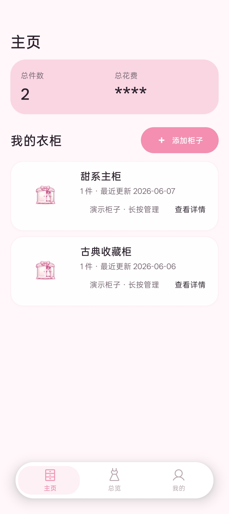
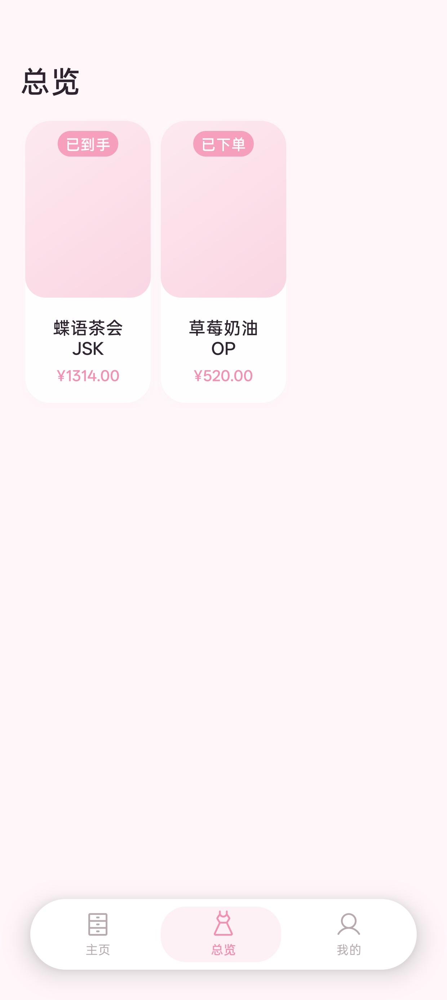
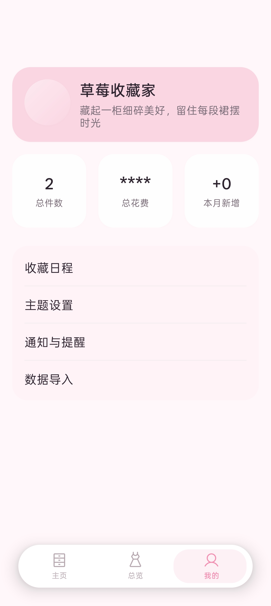
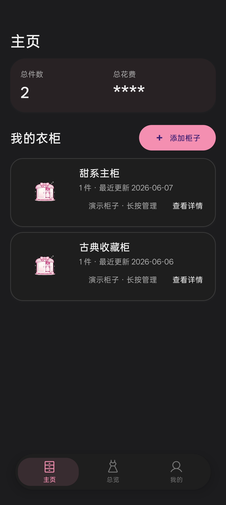
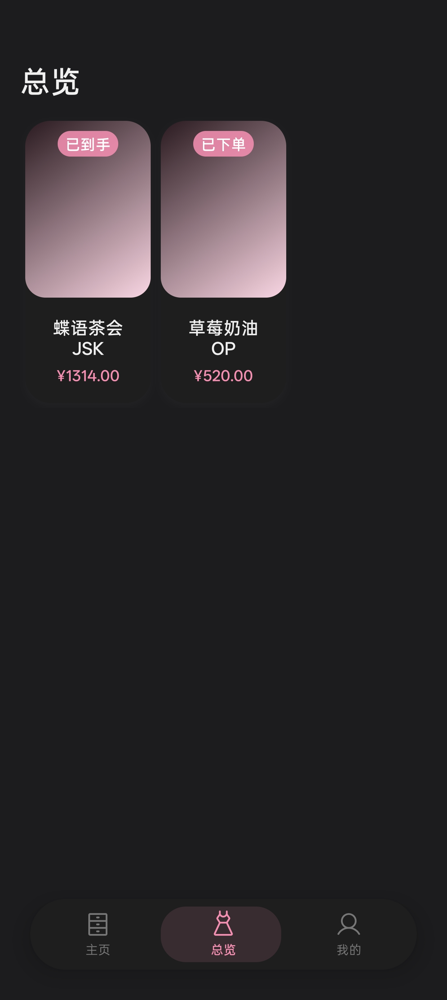
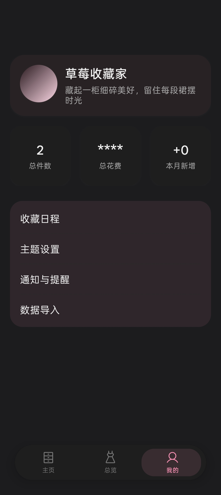

# 裙匣 (LoXia)

一款专为 Lolita 服饰爱好者设计的衣柜管理应用。

## 功能特性

### 🗄️ 衣柜管理
- 创建多个衣柜，分类管理不同风格的裙子
- 自定义衣柜封面，拖拽排序
- 支持衣柜列表视图和网格视图切换

### 👗 裙子记录
- 记录每件裙子的详细信息：
  - 衣服名称、店铺/品牌、购买渠道
  - 价格（标价、意向金、定金、尾款、全款、运费）
  - 购入时间、备注
  - 衣服主图上传
- 支持编辑和删除裙子记录

### 📊 状态追踪
- 六种状态完整跟踪购买流程：
  - **待抢** → 心愿单阶段
  - **付意向** → 意向金支付
  - **付定金** → 定金支付
  - **补尾款** → 尾款支付
  - **待发货** → 等待发货
  - **已到手** → 已收到
- 状态流转可视化，一目了然

### 📅 收藏日程中心
- **近期需要处理**：未来 30 天内的关键节点一目了然
- **月份时间轴**：横向滚动，快速查看各月安排
- **时间节点管理**：待抢、付意向、付定金、补尾款、发货、收货
- **待办提醒**：距离截止日期剩余天数，紧急事项高亮

### 💰 花费统计
- 总花费统计（支持隐藏/显示）
- 月度新增统计
- 本月待支付金额
- 未来 30 天待办数量

### 🤖 AI 智能导入
- 将提示词复制到 AI 助手，配合截图即可自动解析并导入
- 支持批量导入多件裙子

### 🔔 通知提醒
- 按状态设置提醒（待抢、付意向、付定金、补尾款）
- 自定义提前提醒天数
- 支持多种提醒频率：
  - 仅一次
  - 提前多次
  - 每日循环
- 自定义提醒时间和铃声
- 开机自动恢复提醒

### 🎨 主题切换
- 浅色模式
- 深色模式
- 跟随系统
- 粉色系主题，甜美可爱

### 👤 个人资料
- 自定义头像和昵称
- 每日浪漫标语（21 条随机显示）
- 连续记录天数统计

### 📦 数据备份
- JSON 格式导出全部数据
- 支持导入备份数据
- 本地存储，隐私安全

## 应用截图

  
  
  

  
  
  

## 使用说明

### 添加裙子
1. 进入衣柜详情页
2. 点击「+ 添加衣服」按钮
3. 填写裙子信息（名称、店铺、价格等）
4. 上传裙子主图
5. 保存记录

### AI 导入
1. 进入「数据导入」页面
2. 点击「复制 AI 提示词」
3. 切换到豆包等 AI 应用
4. 上传裙子截图并发送提示词
5. 复制 AI 返回的数据
6. 回到裙匣，粘贴数据并解析
7. 选择目标衣柜，确认导入

### 设置提醒
1. 进入「通知设置」页面
2. 开启通知提醒
3. 选择需要提醒的状态
4. 设置提前提醒天数
5. 配置提醒时间和频率

## 权限说明

| 权限 | 用途 |
|------|------|
| `POST_NOTIFICATIONS` | 发送提醒通知 |
| `RECEIVE_BOOT_COMPLETED` | 开机后恢复提醒 |
| `SCHEDULE_EXACT_ALARM` | 精确定时提醒 |

## 许可证

本项目仅供学习交流使用。

## 官网

🌐 [loxia.top](https://loxia.top)
